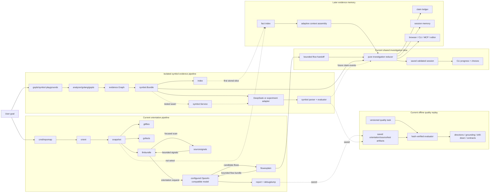

# Repomap system map

This is the working map of repomap: what exists, what is experimental, what is
only planned, and where each idea can be challenged independently. It describes
the current code rather than an idealized architecture.

Use this document when deciding what to test, replace, keep, or delete. Product
questions remain in [OPEN_QUESTIONS.md](OPEN_QUESTIONS.md), demonstrated debt in
[TECHNICAL_DEBT.md](TECHNICAL_DEBT.md), and the investigation state machine in
[INVESTIGATION_ENGINE.md](INVESTIGATION_ENGINE.md).

Execution order belongs to [MILESTONES.md](MILESTONES.md). Source-grounded symbol
understanding and the shared investigation loop are complete; the active
milestone is the five-repository quality suite. Modules and challenge cards
below are supporting seams, not competing roadmaps.

[ENGINEER_TRIAL.md](ENGINEER_TRIAL.md) applies one external acceptance lens to
that order: exploration spans M3/M5, the feature `ChangeBrief` is M6, and
onboarding is M7.

## Capability cubes

A cube is a typed capability, not a provider wrapper. It has one validated input,
one validated output, replayable fixtures, and no presentation or orchestration
state inside it. Cubes are named after outcomes such as `read source`, `assess
source`, or `find tests`, never after DeepSeek, Ollama, gopls, or a future UI.

| Capability | Input | Output | Current implementation |
| --- | --- | --- | --- |
| survey repository | repository request | deterministic snapshot and Go facts | `snapshot`, `gofacts`, `sourcesignals` |
| resolve symbol | exact symbol request | bounded `symbol.Bundle` | Go/gopls adapter plus local builder |
| read target source | resolved target | bounded line-addressable source card | local Go source collector |
| assess source | source assessment bundle | normalized claims, unknowns, action | `sourceexplain.Service` with DeepSeek assessor |
| find related tests | source report and structural facts | bounded test-reference evidence | gopls reference adapter plus local reducer |
| evaluate saved journey | versioned task plus hash-verified artifacts | independent quality dimensions | offline `quality.Load` and `quality.Evaluate` |
| present investigation | saved validated state | CLI/browser/editor view | playground prints pending action/choices; browser/editor adapters planned |

The application composition root selects implementations. The main CLI accepts
an explicitly configured OpenAI-compatible endpoint; the current prompt and
client implementation remains in the DeepSeek-named package. A future
`--really-dumb-model` profile can select alternate implementations that split a
request into smaller calls and use stronger local reducers, while returning the
same capability output. There is no generic cube registry and no provider-name
branching inside domain packages.

## Status legend

| Mark | Meaning |
| --- | --- |
| **works** | used by the main CLI or covered by the normal verification scripts |
| **isolated** | executable and tested, but not wired into the main CLI |
| **stored** | implementation exists, but no production workflow consumes it yet |
| **planned** | design direction only; no package should be assumed to exist |
| **debt** | works, but the current boundary is intentionally temporary |

## Completed milestones

| Milestone | What was proved | Main artifacts |
| --- | --- | --- |
| Local repository survey | a large Go repository can be reduced to bounded modules, packages, entrypoints, docs, and edges without an API | `snapshot`, `gofacts`, `llmbundle`, etcd checks |
| Runtime-flow orientation | the first view can be flows and entrypoints rather than a folder dump | `flowexplain`, `orient`, HTML report |
| Source signals | selected files can expose state/I/O/concurrency/error clues without eager full AST indexing | `sourcesignals` |
| Static evidence graph | gopls results can be represented with certainty, provenance, and build scenarios | `analyzer/golang/gopls`, `evidence.Graph` |
| Exact-symbol slice | one target can be resolved and expanded to bounded direct callers/callees while the raw graph stays local | `symbol.Bundle`, symbol playground |
| Weak-model contract | malformed JSON/tagged output can be normalized, warned, locally grounded, and replay-scored | symbol parser/evaluator/fixtures |
| Provider experiments | DeepSeek produces useful symbol orientation; tiny Ollama models prove local structured execution but not comparable semantic quality | prompt/Ollama experiment scripts and ignored artifacts |
| Staged weak-model planning | Qwen 1.5B can reliably select prioritized evidence, a cautious role, and an executable next action when prose is rendered locally | `local-symbol-v2` staged experiment and verifier |
| Local persistence slice | one symbol neighborhood can be stored, reloaded, replaced, and invalidated by referenced file | `internal/index` |
| Source-grounded symbol slice | one exact symbol can be read through a bounded lexical card, conservatively assessed by DeepSeek, and connected to provenance-preserving test references | `sourcecard`, `sourceexplain`, `testevidence`, source replay scripts |
| Shared investigation loop | an orientation-selected candidate flow and exact symbol can traverse the same pure reducer, stop at a user choice, and resume safely | `investigation`, orientation handoff, investigation playground/scripts |

These milestones are capabilities, not a claim that they already form one
cohesive product workflow.

## Product paths

The intended user journeys share evidence and investigation machinery; they are
not separate products.

| User goal | First focus | Desired result | State |
| --- | --- | --- | --- |
| Explore a repository | repository | navigable components, entrypoints, and flows | ranked orientation works; named flow-to-symbol handoff remains isolated |
| Understand a symbol | exact symbol | evidence-backed responsibility, files, tests, unknowns | resumable CLI vertical slice works |
| Work on a ticket | issue text | change surface, analogs, risks, test plan | planned playbook |
| Diagnose a bug | symptom/test/log | reproduction or discriminating next experiment | planned playbook |
| Onboard | repository + standard questions | evidence-backed learning path | planned playbook |
| Assess impact | diff or symbol | affected callers, flows, tests, boundaries | planned playbook |

## Whole-system map



The user-facing orientation command now has provider-neutral endpoint/model/auth
configuration, but its prompt, response mode, and orchestration still depend on
the concrete `deepseek.Client`. Saved JSON can cross a deliberately small
handoff into the stronger symbol evidence path. That integration currently lives
in `investigation-playground`, not the main CLI or browser. M3 measures this
connected slice before broader context selection, playbooks, or another
orchestration surface are added.

## Modules that exist

### Entrypoints and orchestration

| Module | State | Owns | Does not own |
| --- | --- | --- | --- |
| `cmd/repomap` | works | CLI flags, provider doctor/request preview, wiring, output destination | analysis rules or model prompts |
| `internal/orient` | works, debt | current end-to-end orientation workflow | future shared investigation state |
| `cmd/gopls-playground` | isolated | direct analyzer experiments and human graph summaries | product orchestration |
| `cmd/symbol-playground` | isolated | exact-symbol experiment and optional DeepSeek call | provider neutrality or persistence |
| `cmd/symbol-evaluate` | isolated | replaying and scoring a saved model response | making network calls |
| `cmd/investigation-playground` | isolated | start/handoff/resume wiring, capability execution, saved artifacts | reducer rules or provider registry |
| `cmd/quality-evaluate` | works | loading one versioned task, writing its replay result, and returning pass/fail | model or repository calls |

`internal/orient` imports the concrete DeepSeek client. Runtime endpoint/model/
auth/timeout no longer require a code change, but replacing the output contract
or client still requires touching orchestration.

### Deterministic repository collectors

| Module | State | Input | Output / contract |
| --- | --- | --- | --- |
| `internal/gitfiles` | works | repository path | tracked paths from Git |
| `internal/gofacts` | works | repository + tracked paths | modules, packages, imports, entrypoints, orientation candidates |
| `internal/sourcesignals` | works | selected local Go files | bounded lexical source signals |
| `internal/snapshot` | works | repository + limits | deterministic `snapshot.Snapshot` |
| `internal/flowexplain` | works, heuristic | flow seed + file/package facts | ranked files, tests, docs, and related import edges |

These packages must remain local and deterministic. They may be imperfect, but
their output should be reproducible and inspectable without an API key.

### Static evidence

| Module | State | Owns | Boundary |
| --- | --- | --- | --- |
| `internal/analyzer` | isolated | language-neutral `Provider` request/response port | analyzers return an evidence graph, never prose |
| `internal/analyzer/golang/gopls` | isolated | Go symbol resolution, implementations, direct call hierarchy | static facts under one build scenario, not runtime truth |
| `internal/evidence` | isolated | entities, relations, certainty, provenance, scenarios | language/provider-neutral fact vocabulary |

`analyzer.Provider` is the plug-in seam for a future Rust or other language
adapter. The shared contract is `evidence.Graph`; a new adapter should not force
`symbol`, `index`, or presentation code to understand LSP-specific payloads.

### Bounded context and storage

| Module | State | Input | Output / invariant |
| --- | --- | --- | --- |
| `internal/llmbundle` | works | repository snapshot | bounded orientation bundle; never raw full tree/edges |
| `internal/symbol` bundle | isolated | exact-resolution evidence graph | bounded target, candidates, callers/callees, allowed paths |
| `internal/index` | stored | `symbol.Bundle` | versioned local snapshot, target lookup, path invalidation |

The current index deliberately stores `symbol.Bundle`; it proves persistence and
invalidation for one vertical slice. It is not yet the general fact/claim/session
store described in `INVESTIGATION_ENGINE.md`. Challenging whether the index
should store generic evidence records, shards, or derived neighborhoods is still
valid. Do not add a database before measurements require it.

### Model interpretation

| Module | State | Owns | Boundary |
| --- | --- | --- | --- |
| `internal/deepseek` | works, debt | OpenAI-compatible HTTP transport, DeepSeek defaults, and orientation/symbol prompts | runtime config is provider-neutral; prompts/client type are not |
| `internal/symbol.Service` | isolated | consumer-owned `Explainer` interface and explain/parse/evaluate sequence | model cannot create structural facts |
| `internal/symbol` parser | isolated | tolerant JSON/tagged normalization and local repair | warnings instead of needless failure where safe |
| `internal/symbol` evaluator | isolated | observable contract score | does not claim to measure semantic truth |
| `internal/deepseektest` | works | fixed response and in-memory explainer | deterministic higher-layer tests |

`symbol.Explainer` is the current good provider seam: the consumer defines the
single method it needs. The orientation workflow does not have an equivalent seam
yet. Ollama is currently experiment tooling, not a production provider package.

### Product-quality replay

| Module | State | Owns | Boundary |
| --- | --- | --- | --- |
| `internal/quality` task/loader | works | strict task metadata, safe artifact containment, byte bounds, exact replay-artifact hashes | capture request/context metadata is recorded but not recomputed without uncommitted capture artifacts |
| `internal/quality` evaluator | works | directions, grounding, important evidence, drill-down, overclaim tripwires, contract/size observations | no aggregate semantic score and no free-form prose grading |
| etcd quality fixture | works | one reproducible orientation-to-`kvServer.Put` baseline | historical normalized orientation contract remains unmeasured |
| k6 quality fixture | works | current raw orientation plus `Client.Metrics` source/test drill-down | latency was not captured; one test reference is not test support |

### Presentation and artifacts

| Module | State | Owns | Boundary |
| --- | --- | --- | --- |
| `internal/report` | works | HTML/text rendering from saved artifacts, including orientation-only direction cards | no collection or model calls; candidate cards are not actions yet |
| `internal/debugdump` | works | redacted, replayable run artifacts | never credentials or Authorization headers |
| browser report baseline | works | `./repomap` progress, one orientation call, retained directions, automatic static-report opening | no direction selection or session actions |
| progressive browser UI | planned | navigation and investigation choices | should consume application state, not collectors directly |
| MCP/editor adapter | planned | expose focused actions to external agents/editors | should be another adapter, not the core |

## Durable artifact contracts

These are the useful boundaries to inspect before changing implementation:

| Artifact | Producer | Consumers | Trust level |
| --- | --- | --- | --- |
| `snapshot.Snapshot` | `snapshot` | `llmbundle`, `orient`, debug tools | deterministic local facts |
| `llmbundle.Bundle` | `llmbundle` | orientation model prompt | bounded facts, safe-to-send subset |
| `evidence.Graph` | analyzer adapters | `symbol`, debug/playground, future fact index | facts with certainty/provenance/scenario |
| `symbol.Bundle` | `symbol.Build` | model prompt, parser validator, current index | bounded exact-symbol evidence |
| `symbol.Report` | tolerant parser | user-facing symbol workflow | interpretation plus locally rebuilt structure |
| `symbol.Evaluation` | evaluator | prompt experiments | contract quality, not semantic truth |
| `quality.Task` | fixture author | offline quality loader/evaluator | strict manifest plus exact replay-artifact identity; capture-only hashes remain author metadata |
| `quality.Result` | offline evaluator | checks, CI, human comparison | separate dimensions; top-level pass is conjunction, not a numeric score |
| index JSON snapshot | `index.Save` | `index.Load` | versioned local cache; freshness policy incomplete |

Changing an artifact shape should be treated as a contract change: update its
version or compatibility rules, fixtures, replay tools, and challenge commands.

## Replaceability scorecard

This table separates real modularity from intended modularity.

| Dimension | Current seam | Replace independently? | Remaining coupling |
| --- | --- | --- | --- |
| Language analyzer | `analyzer.Provider -> evidence.Graph` | yes, in the isolated path | only gopls adapter exists; main CLI does not consume the port |
| Symbol model | consumer-owned `symbol.Explainer` | yes in tests/services | playground still constructs DeepSeek directly |
| Orientation model | concrete `deepseek.Client` in `orient` | runtime endpoint/model/auth/timeout only | prompt, response mode, transport type, and orchestration are joined |
| Response syntax | tolerant JSON/tagged parser | mostly | provider capability negotiation is absent |
| Persistence | concrete in-memory + versioned JSON `index` | implementation can be challenged alone | stored record is coupled to `symbol.Bundle` |
| Context selection | `llmbundle` and fixed-limit `symbol.Build` | algorithms can be tested alone | no shared goal-aware budget/selection trace |
| Workflow | `investigation.Reduce` plus explicit `Runner` | yes for the symbol slice | main orientation CLI and future ticket/bug policies are not migrated |
| Quality replay | `quality.Task -> quality.Result` | yes, fully offline | etcd and k6 exist; three repository baselines remain |
| Presentation | saved session plus playground choices | partly | no browser/editor read/action API yet |

The next work should improve one red cell at a time and preserve a runnable
fixture at the boundary. A dynamic plug-in registry would not make these seams
more modular by itself.

## Target modules that do not exist yet

| Planned module | Responsibility | Smallest useful first proof | Must not absorb |
| --- | --- | --- | --- |
| repository freshness | derive repo identity, HEAD, dirty hashes, Go/gopls/build context | reject or selectively invalidate one stale index record | ranking or interpretation |
| context assembly | select a goal-relevant evidence slice under node/edge/source/token budgets | beat fixed symbol bundle on size without losing cited evidence | model calls or session transitions |
| claim ledger | separate facts from inferred/source/test/runtime-supported claims | invalidate one claim when supporting evidence changes | raw model response storage |
| session catalog | discover and retain multiple investigation sessions | reopen one named session without passing its JSON path | repository fact duplication |
| consumer-owned model capability | one validated request/result contract per cube | run one fixture through two clients with the same consumer contract | endpoint/auth config and prompt-specific domain state |
| presentation API | read progress/state and request allowed actions | open one recommended file from a symbol result | analyzer/LSP protocol |

Names in this table describe responsibilities, not approved Go package names or
interfaces. Start concrete. Extract a small consumer-owned interface only when a
second implementation or a test double needs it.

## Challenge cards

Each card is intentionally runnable without completing the rest of the roadmap.

### C1 — Repository survey quality

- Question: are modules, entrypoints, docs, and important edges sufficient for a
  first look at a large Go repository?
- Run: `./scripts/etcd_check.sh ../etcd`.
- Inspect: `tmp/etcd-snapshot.json` and `tmp/etcd-llm-bundle.json`.
- Pass signal: facts exist, entrypoints have `open_files`, and the LLM bundle has
  no raw `file_tree` or raw `internal_edges`.
- Challenge independently: change ranking limits or one fixture in
  `snapshot`, `gofacts`, or `llmbundle`; no provider call is needed.

### C2 — Flow ranking without an LLM

- Question: can deterministic heuristics choose useful files for one runtime
  flow, or are the hard-coded aliases hiding weak evidence?
- Run: `go run ./cmd/repomap ../etcd --offline --flows 4 --json`.
- Inspect: selected files/tests/docs and their explicit reasons.
- Pass signal: a flow is navigable without invented paths.
- Challenge independently: add a flow fixture to `internal/flowexplain` and
  compare rankings before changing prompts.

### C3 — gopls static graph

- Question: does gopls resolve the intended symbol and useful direct neighbours
  under a stated build scenario?
- Run:

  ```sh
  go run ./cmd/gopls-playground \
    --repo ../etcd \
    --query kvServer.Put \
    --out tmp/evidence-examples/etcd.json \
    --summary-out tmp/evidence-examples/etcd.md
  ```

- Pass signal: unique exact target, provenance on every relation, bounded calls,
  and explicit warnings about static/runtime limits.
- Challenge independently: run `./scripts/gopls_examples.sh --fetch` against
  etcd, k6, Prometheus, NATS Server, and golangci-lint.

### C4 — Evidence vocabulary

- Question: are entity IDs, certainty, provenance, relations, and scenarios
  expressive enough without leaking Go/gopls concepts?
- Run: `go test ./internal/evidence ./internal/analyzer/golang/gopls`.
- Pass signal: invalid graphs and unknown scenarios are rejected; duplicate facts
  merge deterministically.
- Challenge independently: hand-build a graph for a non-Go example in a test.
  No new analyzer must be implemented to test the vocabulary.

### C5 — Symbol bundle selection

- Question: is depth-one target evidence the right minimum useful context?
- Run: `./scripts/symbol_check.sh ../etcd kvServer.Put`.
- Inspect: `evidence_graph.json` versus `symbol_bundle.json`.
- Pass signal: the bundle is bounded, contains `open`-able allowed paths, and
  omits the raw analyzer graph.
- Challenge independently: vary candidate/caller/callee limits and measure both
  bytes and lost high-value relations.

### C6 — Parser and evaluator robustness

- Question: can weak models violate formatting without corrupting local facts?
- Run: `go test ./internal/symbol ./cmd/symbol-evaluate`.
- Replay any saved response:

  ```sh
  go run ./cmd/symbol-evaluate \
    --bundle path/to/symbol_bundle.json \
    --response path/to/raw_response.txt \
    --out-dir tmp/replayed-response
  ```

- Pass signal: invented paths/evidence/runtime certainty are rejected or warned;
  structural target/calls are rebuilt locally.
- Challenge independently: add one malformed or semantically vacuous response
  fixture before changing the evaluator.

### C7 — Provider and prompt quality

- Question: what quality/latency/size trade-off does one model provide on the
  same evidence?
- DeepSeek run: `./scripts/symbol_prompt_experiment.sh LABEL ../etcd kvServer.Put json`.
- Staged 1.5B run:
  `./scripts/ollama_symbol_staged_experiment.sh MODEL BUNDLE OUTPUT_DIR`.
- Verify a saved staged run without another model call:
  `./scripts/ollama_staged_check.sh OUTPUT_DIR`.
- Compare two DeepSeek prompt experiments with
  `./scripts/symbol_prompt_compare.sh LEFT_DIR RIGHT_DIR`.
- The obsolete monolithic Ollama prompt experiment was removed; the constrained
  staged protocol is the only maintained local-model regression path.
- Pass signal: request, raw response, warnings, metrics where available, and
  evaluation are replayable with no credentials in artifacts.
- Challenge independently: swap model, schema, or compact prompt one at a time.
  Do not change evidence selection in the same experiment.

### C8 — Local index

- Question: can one bounded neighborhood survive restart and be invalidated when
  any referenced source file changes?
- Run: `go test ./internal/index -count=1`.
- Pass signal: defensive put/query, deterministic save/load, replacement, schema
  rejection, and path invalidation all pass.
- Challenge independently: measure JSON size and lookup/invalidation cost with
  many recorded symbol bundles before proposing SQLite or another database.
- Known limitation: freshness metadata is caller-supplied and the index stores
  symbol bundles rather than a generic fact record.

### C9 — Adaptive context assembly

- State: isolated name-level prototype; its `read_target` output now has a
  working default source-card/assessment capability, while index integration
  remains planned.
- Question: can goal-aware selection produce a smaller and more useful request
  than fixed depth/limits?
- Current experiment: deterministic name preclassification, provenance-aware
  ranking, dynamic role/action schemas, and a machine-readable selection trace.
- Next experiment: consume saved index records and execute `read_target` into a
  bounded source evidence card.
- Compare: bytes/tokens, retained evidence for the goal, omitted frontier, and
  result quality under the same saved model response workflow.
- Pass signal: name-level planning stays below roughly 800 total input tokens
  with no model prose; the later source stage may use 500–1,500 tokens while
  keeping every claim linked to retained evidence.

### C10 — Investigation reducer

- State: M2 slice complete; quality calibration is active in M3.
- Question: can explore/symbol/ticket/bug reuse one state transition model?
- Current experiment: pure table tests plus `cmd/investigation-playground` run
  `goal -> resolve symbol -> read source -> assess source -> find tests -> wait`
  over the exact M1 cube outputs. The reducer owns no context, filesystem,
  analyzer, model client, or presentation call.
- Run locally: `./scripts/investigation_check.sh ../etcd kvServer.Put`.
- Run the DeepSeek branch: `./scripts/investigation_check.sh ../etcd kvServer.Put tmp/investigation-check deepseek`.
- Run orientation handoff plus passive resume:
  `./scripts/investigation_handoff_check.sh ../etcd kvServer.Put`.
- `--resume SESSION` only validates, checks freshness, writes, and presents the
  pending action. Capability execution requires `--continue`; a pending
  `assess_source` additionally requires `--deepseek`. Waiting sessions accept
  either `--finish` or an exact new `--symbol` redirect.
- Pass signal: collectors and model clients appear only as requested actions or
  delivered events, not inside the reducer.
- Current boundary: orientation flow identity is candidate provenance, never an
  inferred symbol; the user supplies the exact symbol. `read_callee` becomes an
  explicit same-revision symbol redirect, while bounded test-body inspection is
  deferred and remains visibly unexecuted.
- Challenge independently: feed contradiction, stale action completion,
  cancellation, budget exhaustion, repository change, and user redirection.

### C11 — Source and runtime truth

- State: bounded source-supported claims and test-reference navigation work;
  test-body support and runtime observation remain planned.
- Question: what evidence is required before promoting “likely validates” into a
  source-, test-, or runtime-supported claim?
- Current experiment: `kvServer.Put` collects a bounded lexical source window,
  reconstructs claims only for recognized written shapes, and finds related
  `_test.go` references without claiming what those tests assert.
- Pass signal: claims cite source/test evidence IDs; names and static calls alone
  remain navigation hypotheses.
- Challenge independently: use a deliberately misleading function name and test
  whether the support assessment refuses to overclaim.

### C12 — Presentation boundary

- State: isolated CLI proof; browser/editor surfaces planned.
- Question: can the browser, CLI, MCP, and editor open the same investigation
  state without owning analysis logic?
- First experiment: render a saved session and request “open this file” as an
  action; no live collector or model dependency.
- Pass signal: a presentation adapter can be replaced without changing evidence,
  context selection, or reducer tests.

### C13 — Cross-repository product quality

- State: etcd and k6 baselines work; Prometheus, NATS Server, and golangci-lint
  are still missing.
- Question: does the same product journey select useful directions and support a
  grounded drill-down across materially different large Go repositories?
- Run the committed baseline without network access:
  `./scripts/quality_check.sh`.
- Current etcd signal: five directions covered, 21 unique structured paths
  grounded, four `kvServer.Put` predicates present, two useful test-reference
  paths found, and the source contract at 100/100 with zero parser warnings.
- Current k6 signal: three directions covered, 11 unique structured paths
  grounded, one `Client.Metrics` predicate present, one compatible test-reference
  path found, and both retained raw model contracts clean. The orientation
  request was 38,838 bytes and the source request was 5,167 bytes.
- Explicitly unscored: 17 free-form orientation evidence strings and all claims
  about what referenced tests assert. The historical normalized orientation
  artifact also cannot measure the original provider-response contract.
- Pass signal: every repository has a versioned, revision-pinned, hash-verified
  task; failures identify a dimension instead of hiding behind one score; normal
  verification makes no API or repository call.
- Challenge independently: mutate one saved response, expectation, or artifact
  hash and inspect the resulting slice before refreshing any live model output.

## Dependency rules

Keep these rules while the system evolves:

1. Collectors produce facts, not explanatory prose.
2. Language adapters end at `evidence.Graph` or a future equally explicit fact
   contract; LSP/gopls payloads do not cross that boundary.
3. The model receives a bounded DTO, never the raw repository, raw file tree, or
   raw analyzer graph.
4. Model output may propose claims and actions but cannot manufacture or promote
   facts.
5. Parsing is tolerant where recovery is safe; validation remains strict about
   paths, evidence IDs, certainty, and structural relationships.
6. Presentation consumes saved application state and requests actions; it does
   not invoke collectors directly.
7. Interfaces belong to consumers and stay small. Do not add a registry, DI
   framework, or one interface per package.
8. Every expensive or uncertain module gets a replayable artifact and a focused
   command/test before it is wired into the product.
9. Provider, language, persistence, and presentation choices must be replaceable
   independently; the domain vocabulary and evidence guarantees are the stable
   center.

## Suggested challenge order

If there is only an hour, challenge one row rather than the whole product:

1. **Does the connected journey survive another repository?** C13.
2. **Does local evidence point to the right place?** C1, C3, or C5.
3. **Does the model add value over the evidence?** C6 and C7.
4. **Can context be made smaller without becoming misleading?** C8 and C9.
5. **Can all product modes share one engine?** C10.
6. **Can claims be made trustworthy?** C11.
7. **Can another surface consume it cleanly?** C12.

Record a demonstrated failure in `TECHNICAL_DEBT.md`; record an unresolved
product decision in `OPEN_QUESTIONS.md`; update this map only when a module or
boundary actually changes.
