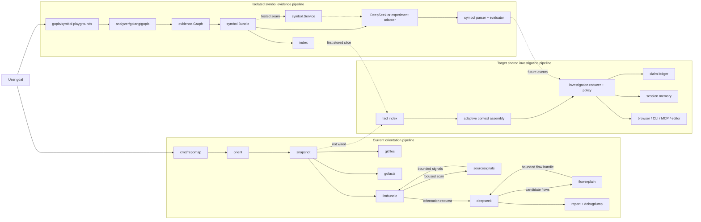

# Repomap system map

This is the working map of repomap: what exists, what is experimental, what is
only planned, and where each idea can be challenged independently. It describes
the current code rather than an idealized architecture.

Use this document when deciding what to test, replace, keep, or delete. Product
questions remain in [OPEN_QUESTIONS.md](OPEN_QUESTIONS.md), demonstrated debt in
[TECHNICAL_DEBT.md](TECHNICAL_DEBT.md), and the investigation state machine in
[INVESTIGATION_ENGINE.md](INVESTIGATION_ENGINE.md).

## Status legend

| Mark | Meaning |
| --- | --- |
| **works** | used by the main CLI or covered by the normal verification scripts |
| **isolated** | executable and tested, but not wired into the main CLI |
| **stored** | implementation exists, but no production workflow consumes it yet |
| **planned** | design direction only; no package should be assumed to exist |
| **debt** | works, but the current boundary is intentionally temporary |

## Completed milestones

| Milestone | What was proved | Main artifacts |
| --- | --- | --- |
| Local repository survey | a large Go repository can be reduced to bounded modules, packages, entrypoints, docs, and edges without an API | `snapshot`, `gofacts`, `llmbundle`, etcd checks |
| Runtime-flow orientation | the first view can be flows and entrypoints rather than a folder dump | `flowexplain`, `orient`, HTML report |
| Source signals | selected files can expose state/I/O/concurrency/error clues without eager full AST indexing | `sourcesignals` |
| Static evidence graph | gopls results can be represented with certainty, provenance, and build scenarios | `analyzer/golang/gopls`, `evidence.Graph` |
| Exact-symbol slice | one target can be resolved and expanded to bounded direct callers/callees while the raw graph stays local | `symbol.Bundle`, symbol playground |
| Weak-model contract | malformed JSON/tagged output can be normalized, warned, locally grounded, and replay-scored | symbol parser/evaluator/fixtures |
| Provider experiments | DeepSeek produces useful symbol orientation; tiny Ollama models prove local structured execution but not comparable semantic quality | prompt/Ollama experiment scripts and ignored artifacts |
| Staged weak-model planning | Qwen 1.5B can reliably select prioritized evidence, a cautious role, and an executable next action when prose is rendered locally | `local-symbol-v2` staged experiment and verifier |
| Local persistence slice | one symbol neighborhood can be stored, reloaded, replaced, and invalidated by referenced file | `internal/index` |

These milestones are capabilities, not a claim that they already form one
cohesive product workflow.

## Product paths

The intended user journeys share evidence and investigation machinery; they are
not separate products.

| User goal | First focus | Desired result | State |
| --- | --- | --- | --- |
| Explore a repository | repository | navigable components, entrypoints, and flows | orientation works; progressive exploration planned |
| Understand a symbol | exact symbol | evidence-backed responsibility, files, tests, unknowns | isolated vertical slice works |
| Work on a ticket | issue text | change surface, analogs, risks, test plan | planned playbook |
| Diagnose a bug | symptom/test/log | reproduction or discriminating next experiment | planned playbook |
| Onboard | repository + standard questions | evidence-backed learning path | planned playbook |
| Assess impact | diff or symbol | affected callers, flows, tests, boundaries | planned playbook |

## Whole-system map



There are currently two real pipelines. The orientation path is user-facing but
provider-bound. The symbol path has stronger evidence contracts and better
experimentation tools but remains isolated. The next architectural milestone is
to connect them through local facts and bounded context selection, not to add a
third orchestration path.

## Modules that exist

### Entrypoints and orchestration

| Module | State | Owns | Does not own |
| --- | --- | --- | --- |
| `cmd/repomap` | works | CLI flags, wiring, output destination | analysis rules or model prompts |
| `internal/orient` | works, debt | current end-to-end orientation workflow | future shared investigation state |
| `cmd/gopls-playground` | isolated | direct analyzer experiments and human graph summaries | product orchestration |
| `cmd/symbol-playground` | isolated | exact-symbol experiment and optional DeepSeek call | provider neutrality or persistence |
| `cmd/symbol-evaluate` | isolated | replaying and scoring a saved model response | making network calls |

`internal/orient` imports the concrete DeepSeek client. This is a known temporary
boundary: replacing the provider currently requires touching orchestration.

### Deterministic repository collectors

| Module | State | Input | Output / contract |
| --- | --- | --- | --- |
| `internal/gitfiles` | works | repository path | tracked paths from Git |
| `internal/gofacts` | works | repository + tracked paths | modules, packages, imports, entrypoints, orientation candidates |
| `internal/sourcesignals` | works | selected local Go files | bounded lexical source signals |
| `internal/snapshot` | works | repository + limits | deterministic `snapshot.Snapshot` |
| `internal/flowexplain` | works, heuristic | flow seed + file/package facts | ranked files, tests, docs, and related import edges |

These packages must remain local and deterministic. They may be imperfect, but
their output should be reproducible and inspectable without an API key.

### Static evidence

| Module | State | Owns | Boundary |
| --- | --- | --- | --- |
| `internal/analyzer` | isolated | language-neutral `Provider` request/response port | analyzers return an evidence graph, never prose |
| `internal/analyzer/golang/gopls` | isolated | Go symbol resolution, implementations, direct call hierarchy | static facts under one build scenario, not runtime truth |
| `internal/evidence` | isolated | entities, relations, certainty, provenance, scenarios | language/provider-neutral fact vocabulary |

`analyzer.Provider` is the plug-in seam for a future Rust or other language
adapter. The shared contract is `evidence.Graph`; a new adapter should not force
`symbol`, `index`, or presentation code to understand LSP-specific payloads.

### Bounded context and storage

| Module | State | Input | Output / invariant |
| --- | --- | --- | --- |
| `internal/llmbundle` | works | repository snapshot | bounded orientation bundle; never raw full tree/edges |
| `internal/symbol` bundle | isolated | exact-resolution evidence graph | bounded target, candidates, callers/callees, allowed paths |
| `internal/index` | stored | `symbol.Bundle` | versioned local snapshot, target lookup, path invalidation |

The current index deliberately stores `symbol.Bundle`; it proves persistence and
invalidation for one vertical slice. It is not yet the general fact/claim/session
store described in `INVESTIGATION_ENGINE.md`. Challenging whether the index
should store generic evidence records, shards, or derived neighborhoods is still
valid. Do not add a database before measurements require it.

### Model interpretation

| Module | State | Owns | Boundary |
| --- | --- | --- | --- |
| `internal/deepseek` | works, debt | current HTTP client and orientation/symbol prompts | named and configured as one provider |
| `internal/symbol.Service` | isolated | consumer-owned `Explainer` interface and explain/parse/evaluate sequence | model cannot create structural facts |
| `internal/symbol` parser | isolated | tolerant JSON/tagged normalization and local repair | warnings instead of needless failure where safe |
| `internal/symbol` evaluator | isolated | observable contract score | does not claim to measure semantic truth |
| `internal/deepseektest` | works | fixed response and in-memory explainer | deterministic higher-layer tests |

`symbol.Explainer` is the current good provider seam: the consumer defines the
single method it needs. The orientation workflow does not have an equivalent seam
yet. Ollama is currently experiment tooling, not a production provider package.

### Presentation and artifacts

| Module | State | Owns | Boundary |
| --- | --- | --- | --- |
| `internal/report` | works | HTML/text rendering from saved artifacts | no collection or model calls |
| `internal/debugdump` | works | redacted, replayable run artifacts | never credentials or Authorization headers |
| browser UI | planned | progress, navigation, investigation choices | should consume application state, not collectors directly |
| MCP/editor adapter | planned | expose focused actions to external agents/editors | should be another adapter, not the core |

## Durable artifact contracts

These are the useful boundaries to inspect before changing implementation:

| Artifact | Producer | Consumers | Trust level |
| --- | --- | --- | --- |
| `snapshot.Snapshot` | `snapshot` | `llmbundle`, `orient`, debug tools | deterministic local facts |
| `llmbundle.Bundle` | `llmbundle` | orientation model prompt | bounded facts, safe-to-send subset |
| `evidence.Graph` | analyzer adapters | `symbol`, debug/playground, future fact index | facts with certainty/provenance/scenario |
| `symbol.Bundle` | `symbol.Build` | model prompt, parser validator, current index | bounded exact-symbol evidence |
| `symbol.Report` | tolerant parser | user-facing symbol workflow | interpretation plus locally rebuilt structure |
| `symbol.Evaluation` | evaluator | prompt experiments | contract quality, not semantic truth |
| index JSON snapshot | `index.Save` | `index.Load` | versioned local cache; freshness policy incomplete |

Changing an artifact shape should be treated as a contract change: update its
version or compatibility rules, fixtures, replay tools, and challenge commands.

## Replaceability scorecard

This table separates real modularity from intended modularity.

| Dimension | Current seam | Replace independently? | Remaining coupling |
| --- | --- | --- | --- |
| Language analyzer | `analyzer.Provider -> evidence.Graph` | yes, in the isolated path | only gopls adapter exists; main CLI does not consume the port |
| Symbol model | consumer-owned `symbol.Explainer` | yes in tests/services | playground still constructs DeepSeek directly |
| Orientation model | concrete `deepseek.Client` in `orient` | no | provider config, prompt, transport, and orchestration are joined |
| Response syntax | tolerant JSON/tagged parser | mostly | provider capability negotiation is absent |
| Persistence | concrete in-memory + versioned JSON `index` | implementation can be challenged alone | stored record is coupled to `symbol.Bundle` |
| Context selection | `llmbundle` and fixed-limit `symbol.Build` | algorithms can be tested alone | no shared goal-aware budget/selection trace |
| Workflow | concrete `orient.Run` | no | explore, symbol, and future ticket/bug have no shared reducer |
| Presentation | saved artifacts consumed by `report` | partly | no stable investigation-state read/action API yet |

The next work should improve one red cell at a time and preserve a runnable
fixture at the boundary. A dynamic plug-in registry would not make these seams
more modular by itself.

## Target modules that do not exist yet

| Planned module | Responsibility | Smallest useful first proof | Must not absorb |
| --- | --- | --- | --- |
| repository freshness | derive repo identity, HEAD, dirty hashes, Go/gopls/build context | reject or selectively invalidate one stale index record | ranking or interpretation |
| context assembly | select a goal-relevant evidence slice under node/edge/source/token budgets | beat fixed symbol bundle on size without losing cited evidence | model calls or session transitions |
| investigation | pure reducer for goal/focus/questions/evidence/claims/actions | run current symbol flow through table-tested state transitions | collector implementation details |
| claim ledger | separate facts from inferred/source/test/runtime-supported claims | invalidate one claim when supporting evidence changes | raw model response storage |
| session memory | persist user path, frontier, unknowns, accepted/rejected claims | resume one symbol investigation at the same focus | repository fact duplication |
| provider-neutral model adapter | endpoint/model/auth/timeout/output capability | run one fixture through DeepSeek and Ollama with the same consumer contract | prompt-specific domain state |
| presentation API | read progress/state and request allowed actions | open one recommended file from a symbol result | analyzer/LSP protocol |

Names in this table describe responsibilities, not approved Go package names or
interfaces. Start concrete. Extract a small consumer-owned interface only when a
second implementation or a test double needs it.

## Challenge cards

Each card is intentionally runnable without completing the rest of the roadmap.

### C1 — Repository survey quality

- Question: are modules, entrypoints, docs, and important edges sufficient for a
  first look at a large Go repository?
- Run: `./scripts/etcd_check.sh ../etcd`.
- Inspect: `tmp/etcd-snapshot.json` and `tmp/etcd-llm-bundle.json`.
- Pass signal: facts exist, entrypoints have `open_files`, and the LLM bundle has
  no raw `file_tree` or raw `internal_edges`.
- Challenge independently: change ranking limits or one fixture in
  `snapshot`, `gofacts`, or `llmbundle`; no provider call is needed.

### C2 — Flow ranking without an LLM

- Question: can deterministic heuristics choose useful files for one runtime
  flow, or are the hard-coded aliases hiding weak evidence?
- Run: `go run ./cmd/repomap ../etcd --offline --flows 4 --json`.
- Inspect: selected files/tests/docs and their explicit reasons.
- Pass signal: a flow is navigable without invented paths.
- Challenge independently: add a flow fixture to `internal/flowexplain` and
  compare rankings before changing prompts.

### C3 — gopls static graph

- Question: does gopls resolve the intended symbol and useful direct neighbours
  under a stated build scenario?
- Run:

  ```sh
  go run ./cmd/gopls-playground \
    --repo ../etcd \
    --query kvServer.Put \
    --out tmp/evidence-examples/etcd.json \
    --summary-out tmp/evidence-examples/etcd.md
  ```

- Pass signal: unique exact target, provenance on every relation, bounded calls,
  and explicit warnings about static/runtime limits.
- Challenge independently: run `./scripts/gopls_examples.sh --fetch` against
  etcd, k6, Prometheus, NATS Server, and golangci-lint.

### C4 — Evidence vocabulary

- Question: are entity IDs, certainty, provenance, relations, and scenarios
  expressive enough without leaking Go/gopls concepts?
- Run: `go test ./internal/evidence ./internal/analyzer/golang/gopls`.
- Pass signal: invalid graphs and unknown scenarios are rejected; duplicate facts
  merge deterministically.
- Challenge independently: hand-build a graph for a non-Go example in a test.
  No new analyzer must be implemented to test the vocabulary.

### C5 — Symbol bundle selection

- Question: is depth-one target evidence the right minimum useful context?
- Run: `./scripts/symbol_check.sh ../etcd kvServer.Put`.
- Inspect: `evidence_graph.json` versus `symbol_bundle.json`.
- Pass signal: the bundle is bounded, contains `open`-able allowed paths, and
  omits the raw analyzer graph.
- Challenge independently: vary candidate/caller/callee limits and measure both
  bytes and lost high-value relations.

### C6 — Parser and evaluator robustness

- Question: can weak models violate formatting without corrupting local facts?
- Run: `go test ./internal/symbol ./cmd/symbol-evaluate`.
- Replay any saved response:

  ```sh
  go run ./cmd/symbol-evaluate \
    --bundle path/to/symbol_bundle.json \
    --response path/to/raw_response.txt \
    --out-dir tmp/replayed-response
  ```

- Pass signal: invented paths/evidence/runtime certainty are rejected or warned;
  structural target/calls are rebuilt locally.
- Challenge independently: add one malformed or semantically vacuous response
  fixture before changing the evaluator.

### C7 — Provider and prompt quality

- Question: what quality/latency/size trade-off does one model provide on the
  same evidence?
- DeepSeek run: `./scripts/symbol_prompt_experiment.sh LABEL ../etcd kvServer.Put json`.
- Ollama run: `./scripts/ollama_symbol_experiment.sh MODEL BUNDLE OUTPUT_DIR`.
- Staged 1.5B run:
  `./scripts/ollama_symbol_staged_experiment.sh MODEL BUNDLE OUTPUT_DIR`.
- Verify a saved staged run without another model call:
  `./scripts/ollama_staged_check.sh OUTPUT_DIR`.
- Compare two DeepSeek prompt experiments with
  `./scripts/symbol_prompt_compare.sh LEFT_DIR RIGHT_DIR`.
- Cross-provider comparison currently uses each directory's
  `symbol_evaluation.json` plus Ollama's `ollama_metrics.json`; a single
  provider-neutral comparison command is still missing.
- Pass signal: request, raw response, warnings, metrics where available, and
  evaluation are replayable with no credentials in artifacts.
- Challenge independently: swap model, schema, or compact prompt one at a time.
  Do not change evidence selection in the same experiment.

### C8 — Local index

- Question: can one bounded neighborhood survive restart and be invalidated when
  any referenced source file changes?
- Run: `go test ./internal/index -count=1`.
- Pass signal: defensive put/query, deterministic save/load, replacement, schema
  rejection, and path invalidation all pass.
- Challenge independently: measure JSON size and lookup/invalidation cost with
  many recorded symbol bundles before proposing SQLite or another database.
- Known limitation: freshness metadata is caller-supplied and the index stores
  symbol bundles rather than a generic fact record.

### C9 — Adaptive context assembly

- State: isolated prototype for name-level symbol evidence; index integration and
  source evidence remain planned.
- Question: can goal-aware selection produce a smaller and more useful request
  than fixed depth/limits?
- Current experiment: deterministic name preclassification, provenance-aware
  ranking, dynamic role/action schemas, and a machine-readable selection trace.
- Next experiment: consume saved index records and execute `read_target` into a
  bounded source evidence card.
- Compare: bytes/tokens, retained evidence for the goal, omitted frontier, and
  result quality under the same saved model response workflow.
- Pass signal: name-level planning stays below roughly 800 total input tokens
  with no model prose; the later source stage may use 500–1,500 tokens while
  keeping every claim linked to retained evidence.

### C10 — Investigation reducer

- State: planned.
- Question: can explore/symbol/ticket/bug reuse one state transition model?
- First experiment: pure table test for `goal -> resolve -> evidence -> unsupported
  claim -> request source -> reassess -> stop`.
- Pass signal: collectors and model clients appear only as requested actions or
  delivered events, not inside the reducer.
- Challenge independently: feed contradiction, cancellation, budget exhaustion,
  repository change, and user redirection events.

### C11 — Source and runtime truth

- State: planned.
- Question: what evidence is required before promoting “likely validates” into a
  source-, test-, or runtime-supported claim?
- First experiment: for one chosen symbol only, collect bounded signature,
  documentation, branches/calls/returns, and related test locations.
- Pass signal: claims cite source/test evidence IDs; names and static calls alone
  remain navigation hypotheses.
- Challenge independently: use a deliberately misleading function name and test
  whether the support assessment refuses to overclaim.

### C12 — Presentation boundary

- State: planned.
- Question: can the browser, CLI, MCP, and editor open the same investigation
  state without owning analysis logic?
- First experiment: render a saved session and request “open this file” as an
  action; no live collector or model dependency.
- Pass signal: a presentation adapter can be replaced without changing evidence,
  context selection, or reducer tests.

## Dependency rules

Keep these rules while the system evolves:

1. Collectors produce facts, not explanatory prose.
2. Language adapters end at `evidence.Graph` or a future equally explicit fact
   contract; LSP/gopls payloads do not cross that boundary.
3. The model receives a bounded DTO, never the raw repository, raw file tree, or
   raw analyzer graph.
4. Model output may propose claims and actions but cannot manufacture or promote
   facts.
5. Parsing is tolerant where recovery is safe; validation remains strict about
   paths, evidence IDs, certainty, and structural relationships.
6. Presentation consumes saved application state and requests actions; it does
   not invoke collectors directly.
7. Interfaces belong to consumers and stay small. Do not add a registry, DI
   framework, or one interface per package.
8. Every expensive or uncertain module gets a replayable artifact and a focused
   command/test before it is wired into the product.
9. Provider, language, persistence, and presentation choices must be replaceable
   independently; the domain vocabulary and evidence guarantees are the stable
   center.

## Suggested challenge order

If there is only an hour, challenge one row rather than the whole product:

1. **Does local evidence point to the right place?** C1, C3, or C5.
2. **Does the model add value over the evidence?** C6 and C7.
3. **Can context be made smaller without becoming misleading?** C8 and C9.
4. **Can all product modes share one engine?** C10.
5. **Can claims be made trustworthy?** C11.
6. **Can another surface consume it cleanly?** C12.

Record a demonstrated failure in `TECHNICAL_DEBT.md`; record an unresolved
product decision in `OPEN_QUESTIONS.md`; update this map only when a module or
boundary actually changes.
